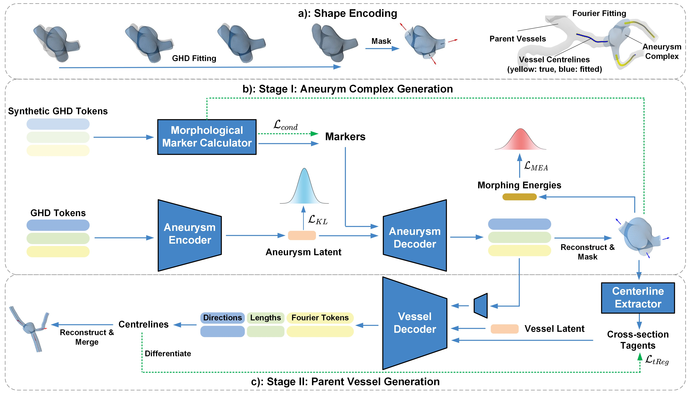
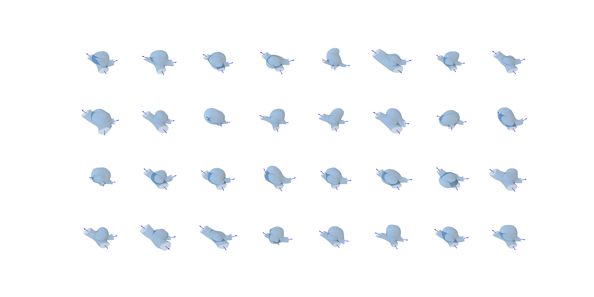
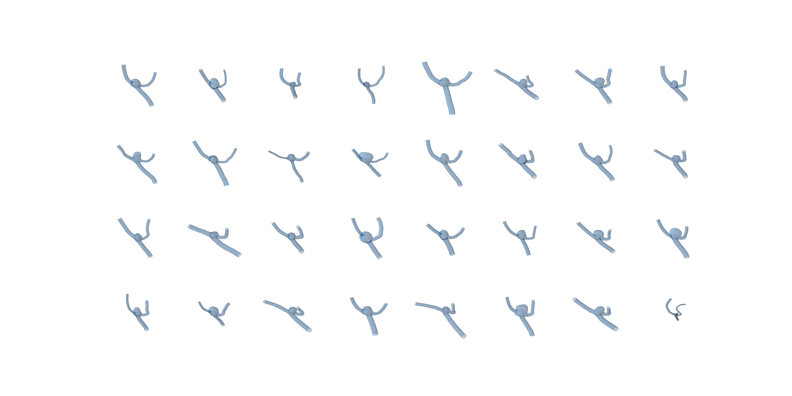

# Two-Stage Conditional Mesh Generation for Intracranial Aneurysms
## Abstract

A generative model for the mesh geometry of intracranial aneurysms (IAs) is crucial for training networks to predict blood flow forces in real time, a key factor in disease progression. This need is highlighted in the absence of large imaging datasets. Existing statistical shape generation methods struggle to capture detailed IA features and ignore the relationship between IA pouches and parent vessels, limiting physiological realism. We propose AneuG, a two-stage Variational Autoencoder (VAE)-based mesh generation model for IAs. In the first stage, AneuG generates low-dimensional Graph Harmonic Deformation (GHD) tokens to encode and reconstruct aneurysm pouch shapes. Morphing energies of generated shapes are aligned to real ones’ to improve generation fidelity. In the second stage, AneuG generates parent vessels by producing spatial centrelines conditioned on generated GHD tokens and propagating vascular cross-sections. AneuG further enables controlled IA shape generation based on clinically relevant morphological parameters via a differentiable morphology parameter calculator. IA shape generation can thus be controlled for blood flow simulations to understand effects of specific clinical shape parameters on fluid dynamics.

## Generation Gallery
### First-stage Unconditonal Generation

    
Click for mesh visualization

    

### Second-stage Unconditonal Generation

    
Click for mesh visualization

    

  
Toggle 3D Model

  <model-viewer src="media/1.obj" 
                camera-controls 
                auto-rotate 
                ar 
                alt="A 3D model">
  </model-viewer>

## Methodology Highlights
### Morphoing Energy Alignment (MEA)
For many locations in the brain, the development of intracranial aneurysms could be rare, meaning for some topologies gathering a large dataset would be difficult. We seek methods to inject more knowledge into the model training. We compute morphing energies upon our dataset and Shapiro–Wilk test show that the laplacian energy and the rigid energy are normal. We therefore sample from the distribution encoded by the real shapes and align the generated shapes' energies to the real ones' through KL divergence. Ablation results show improvement of generation fidelity on most scenarios.

### Morphological Marker Calculator (MMC)
We need to calcualte the morphological markers in a differentiable way to allow the first-stage decoder to understand the geometric meaning with limited training data. Currently, we offer these morphological markers options:
- Aspect Ratio (AR)
- Neck Size (NS)
- Dome Volume (DV)
- Lobulation Index (LI = Surface Area of the Dome / Dome Volume)

Since generated aneurysm complexes in the first stage are all wapred from the canonical mesh, we naturally gain registration of the surfaces. This allows us to track the location of aneurysm domes. Users can therefore define their own morphological markers and add them into MMC.

We first train a unconditional first-stage VAE and pass a large amount of synthetic shapes through MMC to approximate the distribution of all morphological markers. When training the conditional first-stage VAE, we sample from this distribution to get the conditions. This avoids unphysical marker combinations. For example, it is uncommon for both AR and NS to be large.

### Differentiable Centreline Extraction (DCE)
Extracting centrelines from parent vessel meshes is essential for multiple parts of this project. Traditionally, this is done using an energy-based method which assigns lower energy to volumes further away from surface mesh and solve a PDE to find a route costing minimal energy. Though robust, this method is unfortunately not differentiable.

We adpot a wave-propagation based method to extract centrelines from parent vessels in a differentiable way. Define stand laplacian of a given vascular strucutre as $L$, we perform a registration by manually pick one node at the end of each parent vessel branch. Through iterative multiplication of $L$ and record newly activated nodes, we propagate the energy and record a series of node loops. And the centreline point cloud would be the center of these loops.

We rely on DCE at multiple parts of this project:
- During GHD fitting, we use DCE to extract centreline point cloud and calcaulte Chamfer Distance with truth data obtained using traditional method. This helps guding the vessel branches to warp to roughly correct locations, which accelerate the convergence.
- During the first-stage training, we use the recorded loop information to process generated aneurysm complexes. We mask a fixed amount of loops on the meshes for every parent vessel branch.
- During the second-stage training, we extract the tangent direction vector of vessel branches by performing simple finite difference on the extracted centreline point clouds. This allows us to apply regulization term $\mathcal L_{tReg}$.

## Installation guide
### For Biomechanics researchers
Under construction.
Download checkpoint zip file from: https://drive.google.com/file/d/1bPE5HPo9jxg5_TyPZcfuxBhSwJTJA1C_/view?usp=share_link and unzip it into the project working directory.
Run second_stage.ipynb